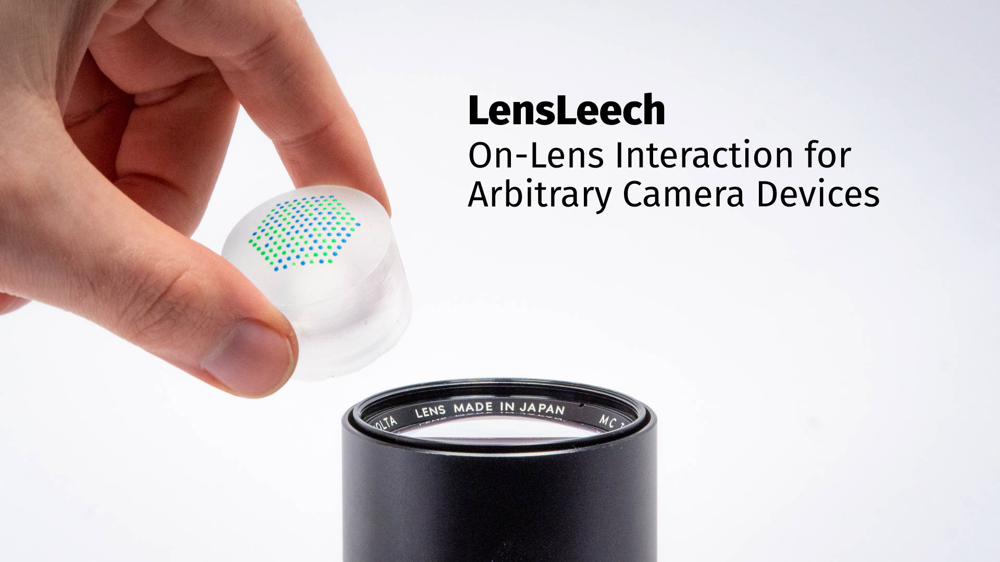

This is the repository for **LensLeech: On-Lens Interaction for Arbitrary Camera Devices**, a soft silicone attachment to detect tangible input directly on and above camera lenses.

---

## Overview:

Refer to the READMEs in the subdirectories for information about each topic.

### Fabrication

Refer to the [fabrication README](/fabrication) for details about a reliable process, [all the unreliable ones](/fabrication#things-that-did-not-work) and simpler [alternatives](/fabrication#alternatives).

### Pattern generation

The script for brute-force generation of hexagonal DeBruijn-like patterns can be found in [/pattern](/pattern).

### Processing

The processing pipeline for reading image data from files and live sources, detecing LensLeech patterns and detecting input gestures can be found in [/processing](/processing).

### Application Examples

The CAD models for the application examples can found in [/applicationexamples](/applicationexamples). The Android app for the hybrid viewfinder is located in [/app](/app).

### GUI

LensLeech data can be visualized with a [web-based GUI](/gui).

### Evaluation

Scripts for data generation, measurement, and plotting of both lowlight performance and rotational error are located in [/evaluation](/evaluation).

---

This repository contains font files for Fira Sans and Fira Mono by the Mozilla Foundation and Telefonica S.A., both fonts are licensed under the [SIL Open Font License](https://scripts.sil.org/cms/scripts/page.php?site_id=nrsi&id=ofl).