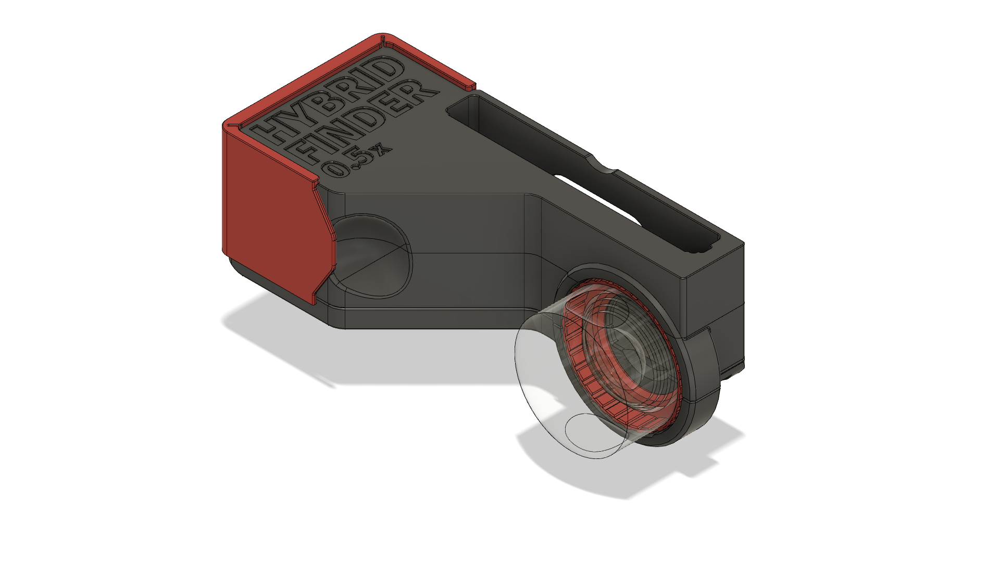
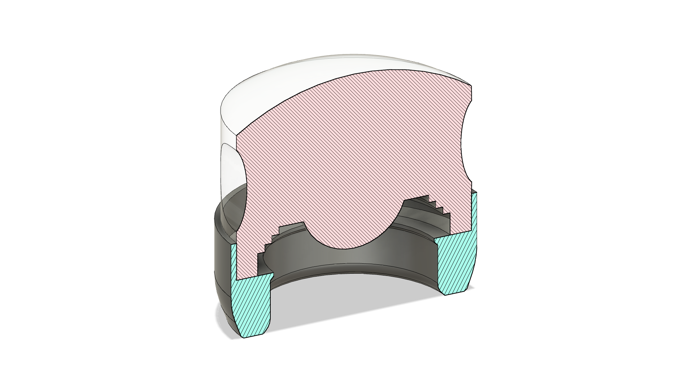
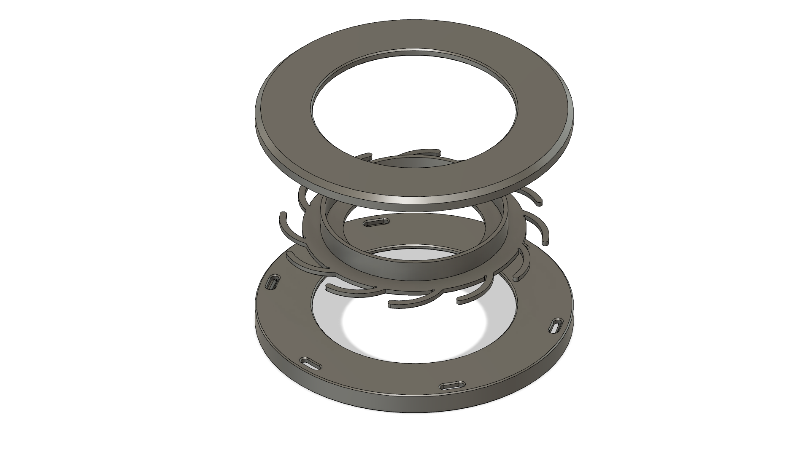

All files are designed to be printed on a standard FDM 3d-printer with a 0.4mm nozzle. 

---

### Hybrid Viewfinder

The HybridViewfinder parts will need some postprocessing with fine sandpaper (400-1200 grit) and need to be thorougly cleaned before optical components are inserted. The ZAR files can be opened with Ansys Zemax OpticStudio and contain all information about the optical components.

---

### Action Knob

---

### Touch Cap

